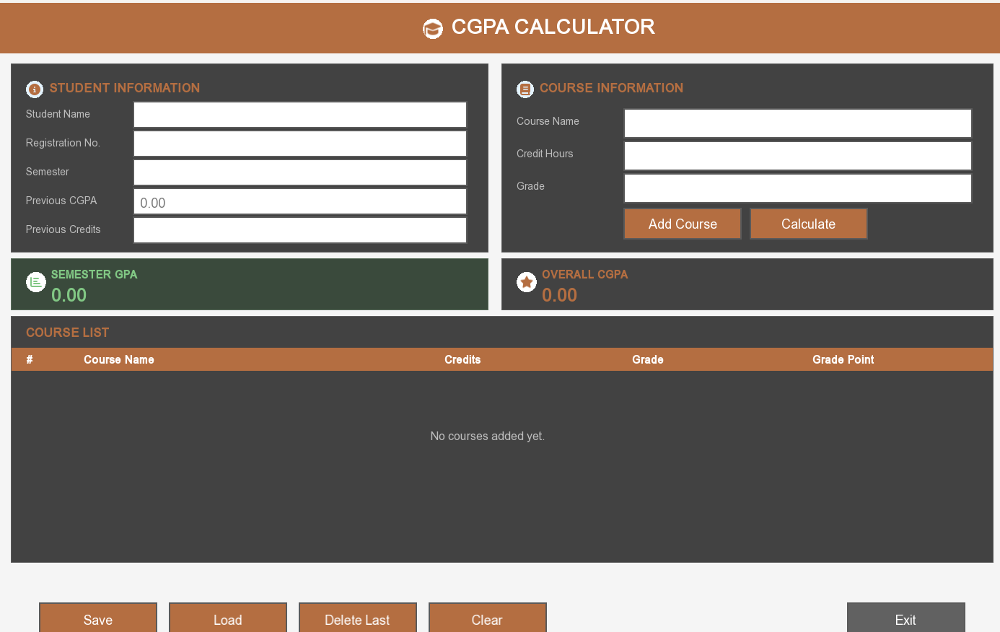
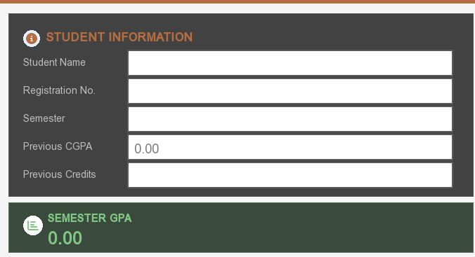
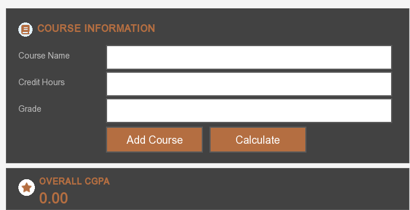
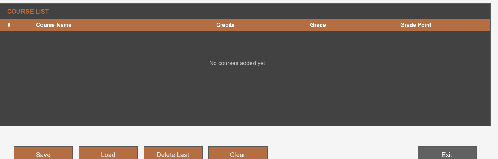

<div align="center">

# 🎓 CGPA Calculator


**A native desktop GPA & CGPA management application, built entirely in C++ with SFML.**


</div>

---

## Overview

**CGPA Calculator** is a fully custom-built academic tracking application designed for students who want a fast, offline, distraction-free way to manage their semester performance. Rather than relying on a spreadsheet or a third-party GUI toolkit, every visual element — buttons, text fields, labels, and layout panels — is hand-implemented on top of **SFML**, giving the application a lightweight footprint and complete control over its look and feel.

The interface is organized as a single-screen dashboard: student details and course entry on top, live GPA/CGPA summary cards in the middle, and a running course ledger below — all themed through one centralized configuration so the entire application's visual identity can be changed by editing a single file.

<p align="center">
  
</p>

---

## Table of Contents

- [Features](#features)
- [Interface Walkthrough](#interface-walkthrough)
- [Architecture](#architecture)
- [Getting Started](#getting-started)
- [Usage Guide](#usage-guide)
- [Grading Scale](#grading-scale)
- [Roadmap](#roadmap)
- [Author](#author)
- [License](#license)

---

## Features

| Category | Capability |
|---|---|
| **Student Profile** | Capture name, registration number, semester, prior CGPA, and prior completed credit hours |
| **Course Management** | Add unlimited courses with name, credit hours, and letter grade |
| **Live Computation** | Instantly calculates weighted **Semester GPA** and cumulative **Overall CGPA** |
| **Data Persistence** | Save and reload complete student records via local file storage — no database required |
| **Record Editing** | Remove the most recent entry or clear the entire session in a single action |
| **Custom UI Toolkit** | Purpose-built `Button`, `TextBox`, and `Label` components — no external GUI dependency |
| **Iconography** | Font Awesome–driven glyph set for clean, scalable section markers |
| **Centralized Theming** | A single `Theme` class governs every color, dimension, and typographic value across the UI |

---

## Interface Walkthrough

### Student Information

Captures the learner's identity and academic starting point — including previous CGPA and previously earned credits, which feed directly into the cumulative calculation.

<p align="center">
  
</p>

### Course Information

A focused entry form for logging individual courses, paired with **Add Course** and **Calculate** actions.

<p align="center">
  
</p>

### Course Ledger

Every added course appears in a structured, color-coded table showing course name, credit hours, letter grade, and computed grade points — giving a transparent, auditable record of how the final GPA was derived.

<p align="center">
  
</p>

---

## Architecture

The application follows a clear separation between **presentation primitives** and **application logic**:

```
CGPA_Calculator/
├── Assets/
│   ├── arial.ttf              Base UI typeface
│   └── fa-solid.otf           Icon glyph font
│
├── Theme.h / Theme.cpp        Centralized color palette, sizing, and typography constants
├── Label.h / Label.cpp        Static text rendering primitive
├── TextBox.h / TextBox.cpp    Interactive input field with focus, placeholder, and validation states
├── Button.h / Button.cpp      Interactive button with hover/press color states
│
├── Course.h / Course.cpp      Represents a single course entry and its grade-point calculation
├── Student.h / Student.cpp    Aggregates a student's profile and course history; computes GPA/CGPA
├── FileManager.h / FileManager.cpp   Handles serialization to and from local storage
│
├── CGPACalculator.h / .cpp    Composes all UI primitives into the application's screen and event loop
└── main.cpp                   Application entry point and window bootstrap
```

This structure keeps rendering concerns (`Label`, `TextBox`, `Button`) fully decoupled from domain logic (`Student`, `Course`), so either layer can be extended independently — for example, swapping the rendering backend or changing the GPA formula without touching the other.

---

## Getting Started

### Prerequisites

- Visual Studio 2022 or later, with the **Desktop Development with C++** workload
- [SFML 3.1.0](https://www.sfml-dev.org/), linked via vcpkg or a manual include/library setup
- A base typeface (e.g. `arial.ttf`) and an icon font (e.g. Font Awesome Free Solid, `.otf`) placed in `Assets/`

### Build Instructions

```bash
git clone https://github.com/uzwashahid/CGPA_Calculator.git
```

1. Open `CGPA_Calculator.sln` in Visual Studio.
2. Verify SFML's include and library directories are correctly linked in project properties.
3. Confirm the required SFML runtime `.dll` files sit alongside the compiled executable.
4. Build the solution (`Ctrl+Shift+B`).
5. Run with `F5`.

---

## Usage Guide

1. **Enter student details** — name, registration number, semester, and (if continuing from a prior term) previous CGPA and previously completed credit hours.
2. **Log each course** — provide the course name, credit hours, and letter grade, then select **Add Course**. The entry appears immediately in the course ledger.
3. **Compute results** — select **Calculate** to generate the current **Semester GPA** and the cumulative **Overall CGPA**, which factors in prior academic history.
4. **Persist your session** — use **Save** to write the current record to disk, and **Load** to restore it in a future session.
5. **Correct mistakes** — **Delete Last** removes the most recently added course; **Clear** resets the entire form and ledger.

---

## Grading Scale

| Letter Grade | Grade Point |
|:---:|:---:|
| A | 4.00 |
| A− | 3.67 |
| B+ | 3.33 |
| B | 3.00 |
| B− | 2.67 |
| C+ | 2.33 |
| C | 2.00 |
| C− | 1.67 |
| D+ | 1.33 |
| D | 1.00 |
| F | 0.00 |

This scale reflects a standard 4.0 grading model and can be adjusted in `Course.cpp` to align with any institution's specific policy.

---

## Roadmap

- [ ] Scrollable course ledger to support unlimited entries beyond the visible viewport
- [ ] Export academic records to PDF or CSV
- [ ] Multi-semester history and trend visualization
- [ ] Runtime theme switching (light/dark and alternate palettes)
- [ ] Inline input validation with contextual error messaging

---

## Author

**Uzwa Shahid**

Designed and engineered from the ground up — including a self-built rendering toolkit, a centralized theming system, and a persistent data layer — as a complete, dependency-light academic utility.

---

## License

Distributed under the [MIT License](LICENSE). See `LICENSE` for details.

---

<div align="center">

If this project was useful to you, consider leaving a ⭐ — it helps others discover it.

</div>
